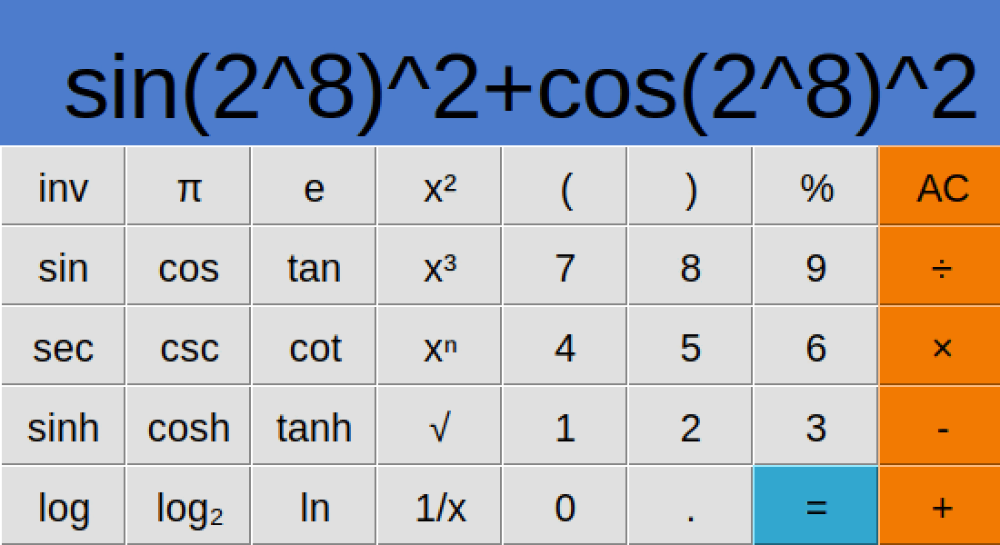

# Calcu Scientific Calculator

Calcu is a scientific calculator written in Python. The calculator evaluates mathematical and logical expressions by converting them from infix notation to Reverse Polish notation and evaluating the expression stack. The GUI for the calculator uses Tkinter. 

  <!--  -->
  

## Features

1. **GUI**: The calculator features a Tkinter-based GUI.
2. **Expression Evaluation**: The calculator first converts the human-readable expression to Reverse Polish notation, ensuring that brackets and appropriate order of operations are respected. This Reverse Polish expression is stored in a stack data structure which is then evaluated py popping the tokens from the stack.
3. **Compatible with mathematical and locial operators**:
    - Elementary operations `(+, -, *, /)`
    - Exp, log, sqrt `(^ or **, ln, log10, log, sqrt)`
    - Trigonometric functions `(sin, cos, tan, csc, sec, cot, sinh, cosh, tanh)` as well as the inverse functions
    - Mathematical constants `(pi, e)`
    - Comparison operations `(==, !=, >, >=, <, <=)`
    - Bitwise operations `(||, &&, |, &, xor, >> (bitshift), <<)`
4. **Input**: An expression can be entered using the keyboard or by clicking the buttons on the calculator interface.

## How Equations Are Evaluated

The calculator evaluates equations using Reverse Polish Notation (RPN). Here's a brief explanation of the evaluation process:

1. **Tokenization**: The input expression is parsed into tokens, which can be numbers, constants, operators, parentheses, or function names.
2. **Conversion to Reverse Polish expression**: The `infixToRevPol` function parses the tokens, converting valid infix expressions to Reverse Polish using the Shunting-yard algorithm.
   - Numbers or constantes (pi, e) are pushed onto an operand stack.
   - When an operator, say *, is encountered then it is pushed on top of the operator stack if it is of higher precedence than the operator on the top of the operator stack; if not, then the operators of higher precedence are popped from the stack before * is pushed
   - When ( is encountered it is pushed onto the stack
   - When ) is encountered then the operators are popped from the operator stack to the expression stack until ) is reached.

3. **Evaluate Reverse Polish Stack**: The Reverse Polish expression is evaluated by simply popping the operands and operators from the stack, performing the operations, until the stack is empty at which point you have the result.

 
## Example expressions

Simple expression
- Expression: $3+6\times 4-3\times (1-2)$
- Expression stack: `[3, 6, 4, '*', '+', 3, 1, 2, '-', '*', '-']`
- Result: 30
    

Boolean evaluation:
- Expression: $5^4==5 \times 5\times 5\times 5$
- Expression stack: `[5, 4, '**', 5, 5, '*', 5, '*', 5, '*', '==']`
- Result: 1

Boolean evaluation 2:
- Expression: $5^6 >= 3^8$
- Expression stack: `[5, 6, '**', 3, 8, '**', '>=']`
- Result: 1

Bitshift
- Expression: $ 2 << 12 $
- Expression stack: ` [2, 12, '<<'] `
- Result: 1

XOR
- Expression: $ 1023 xor 3 $
- Expression stack: ` [1023, 3, 'xor'] `
- Result: 1020

